# Graphs

## Problems


| Name/Link                                                                                                                            | LC Premium | Attempts | Solved on My Own | Figured out Algorithm |
| ------------------------------------------------------------------------------------------------------------------------------------ | ---------- | -------- | ---------------- | --------------------- |
| [Number of Islands](https://leetcode.com/problems/number-of-islands/)                                                                | No         | -        | -                | -                     |
| [Clone Graph](https://leetcode.com/problems/clone-graph/)                                                                            | No         | 1        | No               | Yes                   |
| [Course Schedule](https://leetcode.com/problems/course-schedule/)                                                                    | No         | 1        | No               | Yes                   |
| [Course Schedule II](https://leetcode.com/problems/course-schedule-ii/)                                                              | No         | -        | -                | -                     |
| [Pacific Atlantic Water Flow](https://leetcode.com/problems/pacific-atlantic-water-flow/)                                            | No         | 1        | No               | Yes                   |
| [Number of Islands](https://leetcode.com/problems/number-of-islands/)                                                                | No         | 1        | No               | Yes                   |
| [Longest Consecutive Sequence](https://leetcode.com/problems/longest-consecutive-sequence/)                                          | No         | 1        | Yes              | Yes                   |
| [Surrounded Regions](https://leetcode.com/problems/surrounded-regions/)                                                              | No         | 1        | No               | Yes                   |
| [Max Area of Island](https://leetcode.com/problems/max-area-of-island/)                                                              | No         | -        | -                | -                     |
| [Rotting Oranges](https://leetcode.com/problems/rotting-oranges/)                                                                    | No         | -        | -                | -                     |
| [Redundant Connection](https://leetcode.com/problems/redundant-connection/)                                                          | No         | -        | -                | -                     |
| [Word Ladder](https://leetcode.com/problems/word-ladder/)                                                                            | No         | -        | -                | -                     |
| [Alien Dictionary](https://leetcode.com/problems/alien-dictionary/)                                                                  | Yes        | -        | -                | -                     |
| [Graph Valid Tree](https://leetcode.com/problems/graph-valid-tree/)                                                                  | Yes        | -        | -                | -                     |
| [N of Conn. Components in an Undirected Graph](https://leetcode.com/problems/number-of-connected-components-in-an-undirected-graph/) | Yes        | -        | -                | -                     |

## Representation of graphs

### Adjacency matrix

```python
adj_matrix = [
    [0, 1, 1, 0],
    [1, 0, 1, 1],
    [1, 1, 0, 0],
    [0, 1, 0, 0]
]
```

### Adjacency matrix (weighted)

```python
adj_matrix = [
    [0, 2.5, 1, 0],
    [2.5, 0, 4, 3],
    [1, 4, 0, 0],
    [0, 3, 0, 0]
]
```

### Adjacency list

```python
adj_list = {
    0: [1, 2],
    1: [0, 2, 3],
    2: [0, 1],
    3: [1]
}
```

### Adjacency list (weighted)

```python
weighted_adj_list = {
    0: [(1, 2.5), (2, 1)],
    1: [(0, 2.5), (2, 4), (3, 3)],
    2: [(0, 1), (1, 4)],
    3: [(1, 3)]
}
```

## Types of graphs

### Infinite/Finite

The graph $G=(V, E)$ is called a finite graph if the number of vertices and edges in the graph is limited in number


<br>

The graph $G=(V, E)$ is called a finite graph if the number of vertices and edges in the graph is interminable.

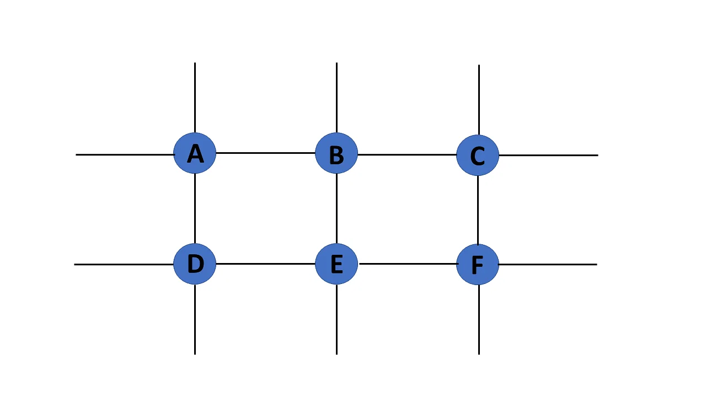

### Pseudo

If a graph $G = (V, E)$ contains a self-loop besides other edges, it is a pseudograph.

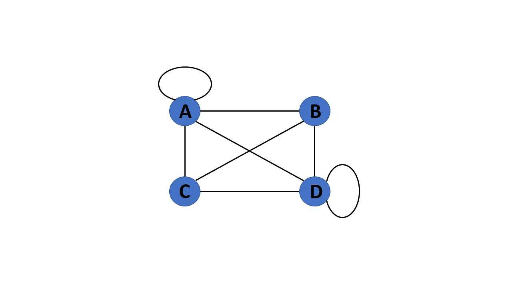

### Multigraph

If there are numerous edges between a pair of vertices in a graph G= (V, E), the graph is referred to as a multigraph. There are no self-loops in a Multigraph.

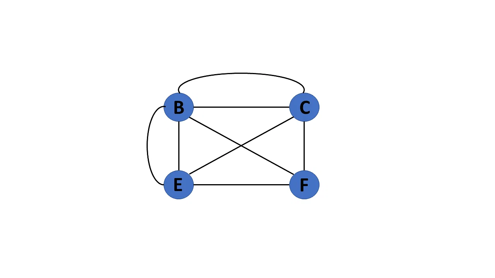


### Directed/Undirected

A directed graph also referred to as a digraph, is a set of nodes connected by edges, each with a direction.

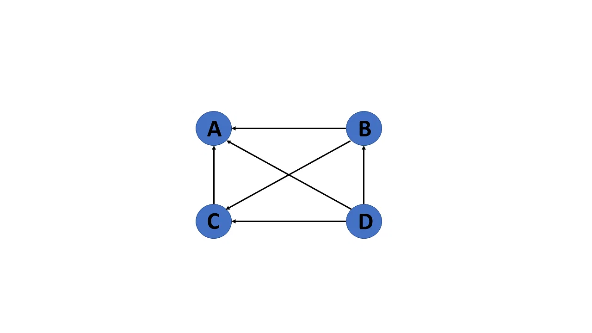

An undirected graph comprises a set of nodes and links connecting them. The order of the two connected vertices is irrelevant and has no direction. You can form an undirected graph with a finite number of vertices and edges.

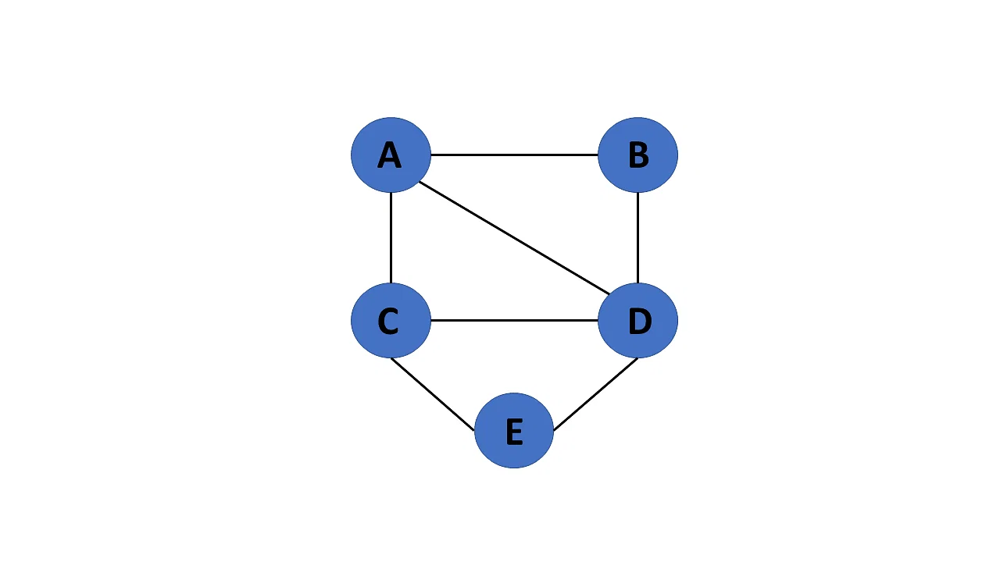

>Undirected graphs will have a symmetric adjacency matrix (meaning Aij = Aji).

### Complete

If a graph $G = (V, E)$ is also a simple graph, it is complete. Using the edges, with n number of vertices must be connected. It's also known as a full graph because each vertex's degree must be $n-1$.


### Regular

If a graph G= (V, E) is a simple graph with the same degree at each vertex, it is a regular graph. As a result, every whole graph is a regular graph.

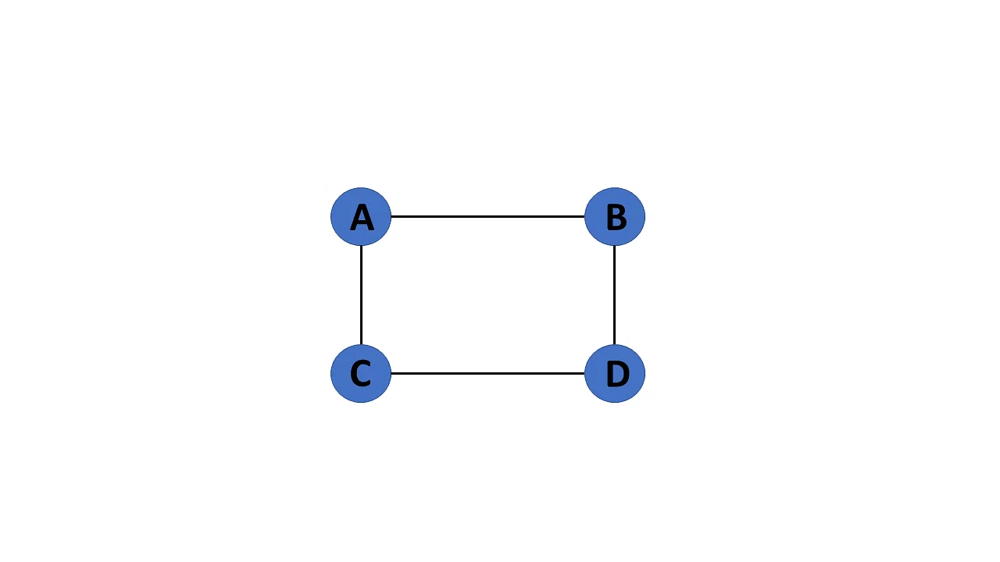

### Cyclic/Acyclic

If a graph contains at least one graph cycle, it is considered to be cyclic.

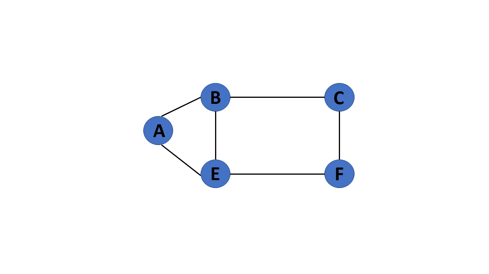

<br>

When there are no cycles in a graph, it is called an acyclic graph.

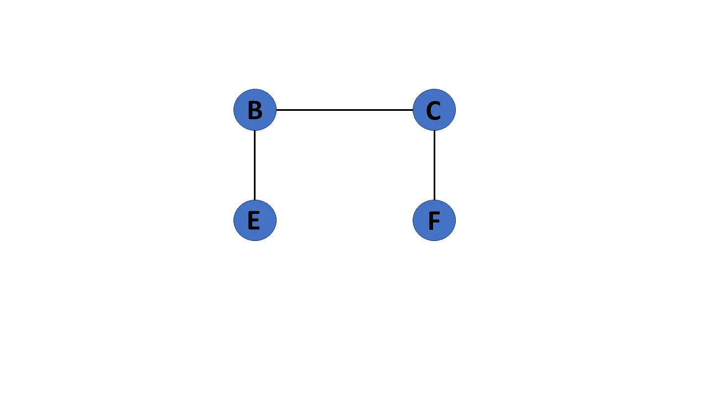

### Connected/Disconnected

If there is a path between one vertex of a graph data structure and any other vertex, the graph is connected.

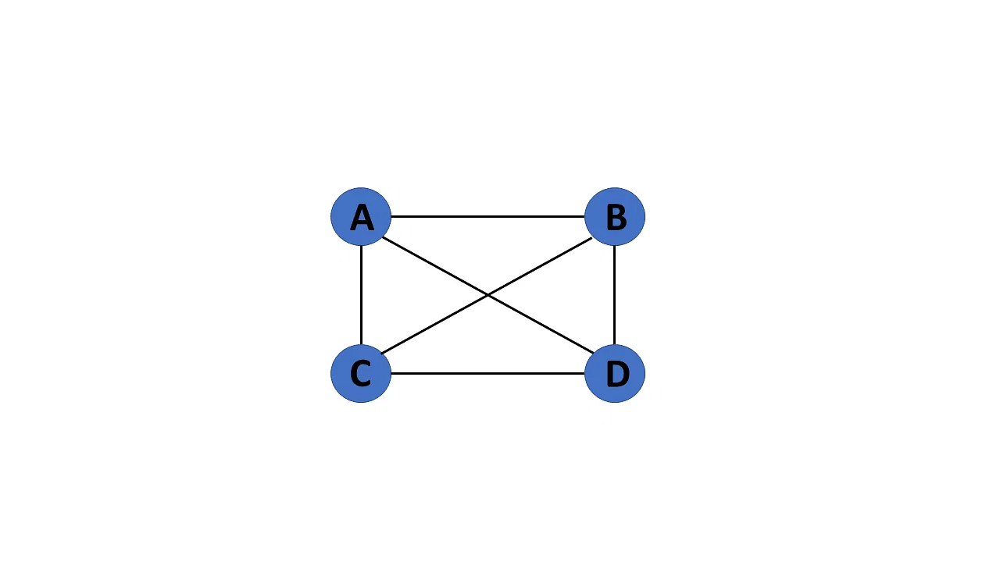

<br>

When there is no edge linking the vertices, you refer to the null graph as a disconnected graph.

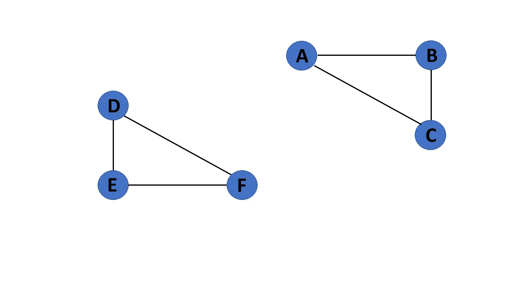

### Euler Graph

A connected graph G is called an Euler graph, if there is a closed trail which includes every edge of the graph G.

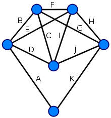

### Axiom about Maximum Number of Edges
In a graph of order $n$:
- the maximum degree of each vertex is $n − 1$ (or $n + 1$ if loops are allowed, because a loop contributes 2 to the degree)
- the maximum number of edges is $n(n − 1)/2$ (or $n(n + 1)/2$ if loops are allowed).


## Common Algorithms
1. DFS:
```python
def dfs_iterative(graph: dict[str], start: str):
    visited = set()
    stack = [start]
    
    while stack:
        current_node = stack.pop()
        if current_node not in visited:
            visited.add(current_node)
            print(current_node)
            
            for neighbour in graph[current_node]:
                if neighbour not in stack:
                    stack.append(neighbour)
                 
                 
def dfs_recursive(graph: dict[str], current_node: str, visited=None):
    if not visited:
        visited = set()
        
    visited.add(current_node)
    print(current_node)
    
    for neighbour in graph[current_node]:
        if neighbour not in visited:
            dfs_recursive(graph, neighbour, visited)
```

2. BFS
3. Dijsktra


## Common problems